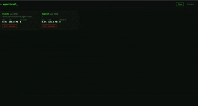

# AgentTrail

See what your AI coding agents are actually doing on your machine — every process, file, and connection, fully local, no telemetry.

  

## Why this exists

AI coding agents (Claude Code, Cursor, Aider, Copilot, Windsurf, Codex CLI, and friends) run commands, spawn processes, and touch files on your behalf — often without a clear, persistent record of exactly what happened. AgentTrail watches your machine locally and keeps a full history of agent activity: process trees, commands run, files created/modified/deleted, and CPU/RAM/disk usage. Nothing leaves your machine.

## Install

```bash
pip install -e .
```

Requires Python 3.11+.

## Quick start

```bash
# Start the background monitoring daemon
agenttrail start

# Open the dashboard (http://localhost:8420)
agenttrail dashboard

# Stop the daemon
agenttrail stop
```

Once the daemon is running, launch your usual AI coding agent (`claude`, `aider`, etc.) as normal — AgentTrail detects it automatically and starts tracking it within a couple of seconds.

## Screenshot



## Architecture

AgentTrail is two independent local processes sharing one SQLite database (`~/.agenttrail/agenttrail.db`):

- **Daemon** (`agenttrail start`) — polls the process table every 2 seconds to detect agent processes and their descendants, samples CPU/RAM/disk usage every 5 seconds, and watches each active session's working directory for filesystem changes.
- **Dashboard** (`agenttrail dashboard`) — a FastAPI server + single-page frontend (plain HTML/JS/Chart.js, no build step) that reads from the same SQLite file to show live sessions and historical timelines.

Because both sides only talk to the local SQLite file, the dashboard can be stopped and restarted independently of the daemon, and history is preserved across restarts of either.

## Known limitations

- macOS and Windows may require elevated permissions for full process introspection (command lines, `cwd()`, I/O counters) on processes not owned by the current user; AgentTrail degrades gracefully (skips the unavailable field) rather than crashing.
- Detection is signature-based (process name / command line substring matching) — an agent that doesn't match one of the known signatures won't be picked up.
- Filesystem watching only covers each session's working directory, not files it touches elsewhere on disk.

## Roadmap (Phase 2)

- Docker container monitoring
- Network/connection tracking
- GPU usage monitoring
- Full-text search across history
- Summary stats and analytics dashboards
- User-configurable settings file
- `--demo` mode for trying AgentTrail without a real agent running

## Contributing

Contributions are welcome! See [CONTRIBUTING.md](CONTRIBUTING.md) for how to set up a dev environment, run tests, and submit a PR.
